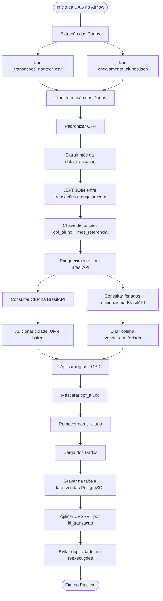

# <p align="center">Pipeline ETL NogTech com Apache Airflow</p>
<p align="center">
  <strong>Projeto Final Disciplina de Práticas Profissionais em Big Data</strong><br>
  7° Periodo | Engenharia de Software | Unicatólica-TO
</p>

## Integrantes
- João Victor Ferreira Costa
- Eville Vitória Nunes Coelho
- Fernanda Galvão Marçal
- Keven Lucas Rodrigues

## Descrição do Projeto
O objetivo deste projeto é implementar um pipeline de ETL orquestrado com **Apache Airflow**, integrando arquivos locais com dados externos da **BrasilAPI**, realizando tratamento, enriquecimento, anonimização e carga final em banco de dados PostgreSQL.

## Integração com Dashboard Analítico

Os dados da camada fato gerados, enriquecidos e anonimizados por este pipeline ETL são consumidos por uma aplicação web exclusiva. 

Para fornecer à diretoria da NogTech uma interface interativa com as métricas de vendas, engajamento e distribuição geográfica, o front-end foi isolado em um ecossistema próprio desenvolvido com **Next.js**, **Tailwind CSS** e **Recharts**.

Para visualizar o código-fonte, a documentação estrutural e a interface do painel, acesse o repositório dedicado clicando no botão abaixo:

[](https://github.com/joao-fcosta/painel-nogtech)

---

## Ferramenta de Orquestração Escolhida

A ferramenta escolhida pela equipe foi o **Apache Airflow**.

O Airflow foi escolhido por permitir:

* Criação de pipelines por meio de DAGs;
* Definição de dependências entre tarefas;
* Visualização gráfica do fluxo de execução;
* Monitoramento de execuções;
* Acompanhamento de logs;
* Configuração de retentativas em caso de falhas.

---

## Estrutura do Projeto

```text
bigdata/
│
├── dags/
│   └── etl_nogtech.py
│
├── data/
│   ├── transacoes_nogtech.csv
│   ├── engajamento_alunos.json
│   └── dados_transformados.csv
│
├── init.sql
├── docker-compose.yml
└── README.md
```

---

## Instruções de Inicialização do Ambiente

### Pré-requisitos

Antes de iniciar o projeto, é necessário ter instalado:

* Docker;
* Docker Compose;
* Git.

---

### 1. Clonar o repositório

```bash
git clone https://github.com/keven-rdr/bigdata.git
cd bigdata
```

---

### 2. Subir o ambiente com Docker Compose

Execute o comando abaixo na raiz do projeto:

```bash
docker compose up -d
```

Esse comando irá inicializar os containers necessários para execução do projeto, incluindo:

* Apache Airflow;
* PostgreSQL.

---

### 3. Verificar se os containers estão em execução

```bash
docker ps
```

Caso os containers estejam ativos, o ambiente estará pronto para uso.

---

## Portas de Acesso

Após inicializar o ambiente, as interfaces e serviços estarão disponíveis nas seguintes portas:

| Serviço        | Porta | Endereço              |
| -------------- | ----: | --------------------- |
| Apache Airflow |  8080 | http://localhost:8080 |
| PostgreSQL     |  5432 | localhost:5432        |

---

## Acesso ao Apache Airflow

A interface visual do Airflow pode ser acessada pelo navegador em:

```text
http://localhost:8080
```

Credenciais de acesso:

```text
Usuário: admin
Senha: admin
```

Na interface do Airflow, é possível:

* Visualizar a DAG do pipeline;
* Executar o pipeline manualmente;
* Acompanhar o grafo de execução;
* Verificar logs das tarefas;
* Consultar o histórico das execuções.

---

## Execução da DAG

Após acessar o Airflow:

1. Localize a DAG do projeto;
2. Ative a DAG;
3. Clique para executar manualmente;
4. Acompanhe a execução das tarefas;
5. Verifique se todas as etapas foram concluídas com sucesso.

O pipeline realiza as seguintes etapas principais:

```text
Extração dos arquivos locais
        ↓
Transformação e cruzamento dos dados
        ↓
Enriquecimento com BrasilAPI
        ↓
Anonimização dos dados sensíveis
        ↓
Carga no PostgreSQL
```

---

## Estratégia de Idempotência

A idempotência garante que o pipeline possa ser executado mais de uma vez sem gerar dados duplicados no destino final.

Neste projeto, a estratégia utilizada é:

```text
Chave natural id_transacao + UPSERT no PostgreSQL
```

O campo `id_transacao` é utilizado como chave primária da tabela `fato_vendas`.

Durante a carga dos dados, o pipeline utiliza uma operação de UPSERT, por meio da lógica:

```sql
INSERT INTO fato_vendas (...)
VALUES (...)
ON CONFLICT (id_transacao) DO UPDATE
```

Com essa estratégia:

* Se a transação ainda não existir, ela será inserida;
* Se a transação já existir, ela será atualizada;
* A reexecução da DAG não gera duplicidade;
* O mesmo lote pode ser processado novamente com segurança.

Dessa forma, o pipeline se mantém consistente mesmo em casos de reprocessamento.

---

## Tratamento de Falhas

O pipeline foi projetado para lidar com falhas sem corromper os dados finais.

As principais estratégias utilizadas são:

* Uso de retentativas configuradas no Airflow;
* Registro de logs das tarefas executadas;
* Cache local para consultas à BrasilAPI;
* Uso de UPSERT para evitar duplicidade em caso de reexecução;
* Possibilidade de reprocessamento da DAG pela interface visual do Airflow.

Caso ocorra uma falha temporária, como instabilidade de rede ou indisponibilidade da BrasilAPI, o Airflow pode tentar executar novamente a tarefa conforme a política de retry definida na DAG.

Além disso, o uso de cache evita chamadas repetidas para o mesmo CEP ou para o mesmo ano de feriados, reduzindo a dependência de chamadas externas repetidas.

---

## Integração com a BrasilAPI

O pipeline utiliza a BrasilAPI para enriquecer os dados das transações.

### Consulta de CEP

Endpoint utilizado:

```text
https://brasilapi.com.br/api/cep/v2/{CEP}
```

Esse endpoint é usado para obter:

* Cidade;
* Estado/UF;
* Bairro.

Para evitar chamadas repetidas, o pipeline utiliza cache por CEP.

---

### Consulta de Feriados

Endpoint utilizado:

```text
https://brasilapi.com.br/api/feriados/v1/{ANO}
```

Esse endpoint é usado para verificar se a data da transação ocorreu em feriado nacional.

A partir dessa consulta, é criada a coluna:

```text
venda_em_feriado
```

Os feriados são armazenados em cache por ano, evitando múltiplas chamadas para o mesmo período.

---

## Validação da Idempotência

Para validar se a idempotência está funcionando, a DAG pode ser executada mais de uma vez.

Após a primeira execução, consulte a quantidade de registros na tabela final:

```sql
SELECT COUNT(*) FROM fato_vendas;
```

Depois, execute a DAG novamente e repita a consulta:

```sql
SELECT COUNT(*) FROM fato_vendas;
```

Se o número de registros permanecer consistente, significa que o pipeline não está duplicando dados.

---

## Destino Final dos Dados

Os dados finais são gravados no PostgreSQL, na tabela:

```text
fato_vendas
```

Essa tabela armazena a visão consolidada das vendas, contendo dados da transação, informações de engajamento, localização obtida pela BrasilAPI, indicação de feriado e dados anonimizados conforme a LGPD.

---

## Encerramento do Ambiente

Para parar os containers, execute:

```bash
docker compose down
```

Caso deseje remover volumes e reiniciar completamente o ambiente:

```bash
docker compose down -v
```

---

## Desenho Inicial do Pipeline

O pipeline segue o modelo ETL: **Extract, Transform e Load**.



---
